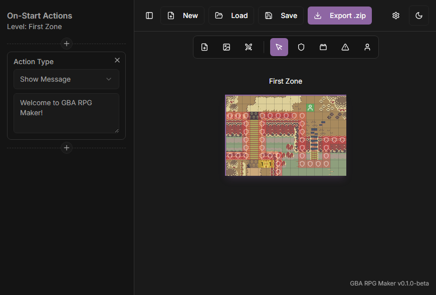

# GBA RPG Maker
A simple tool to make small RPGs for the Game Boy Advance without the need to code.

Background made by [DragonDePlatino](https://opengameart.org/content/zoria-tileset).

## Instalation
Download and install [GValiente's Butano](https://gvaliente.github.io/butano/getting_started.html), this tool is necessary to compile your project.

After the installation, download the [latest release of GBA RPG Maker](https://github.com/elAtsu/GBA-RPG-Maker/releases) for your operating system.

## Getting Started
Before you begin using the program, I recommend you check out the [documentation]() or the [video guide]().

## Notes
If you have any feedback, please leave a comment in the [project's itch.io page]().

I encourage you to make your own version of the engine or translation if you have the knowledge.
